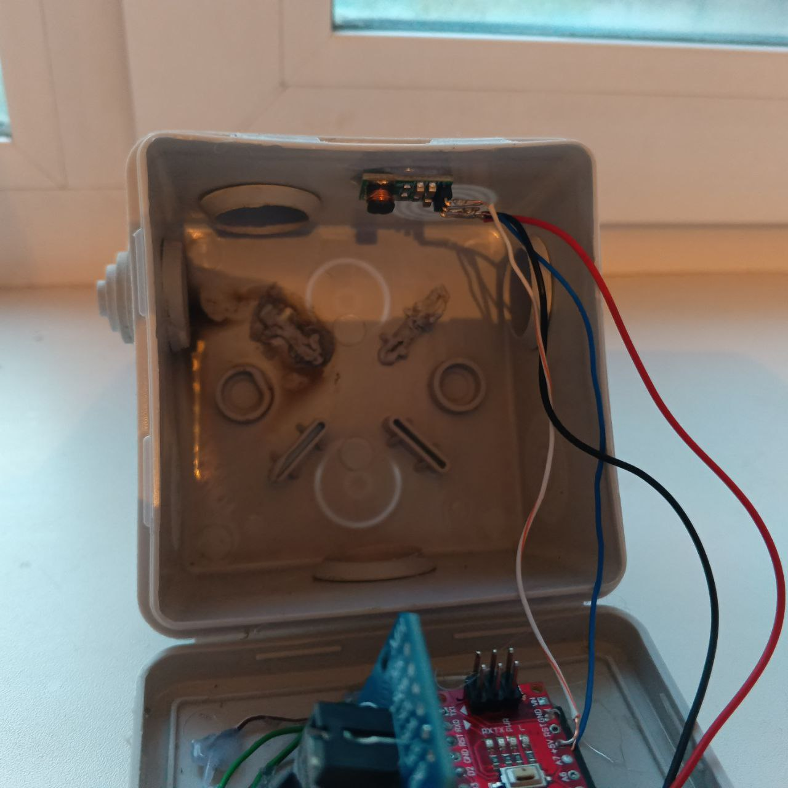
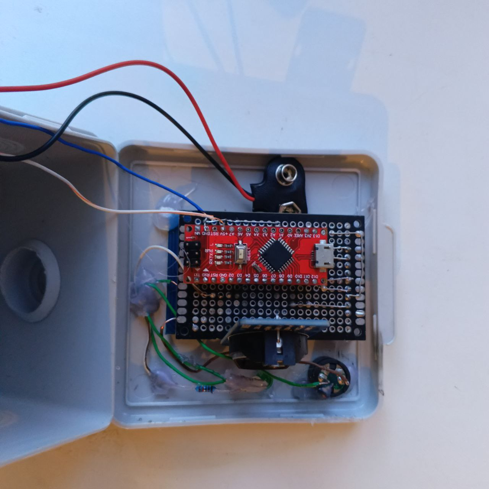
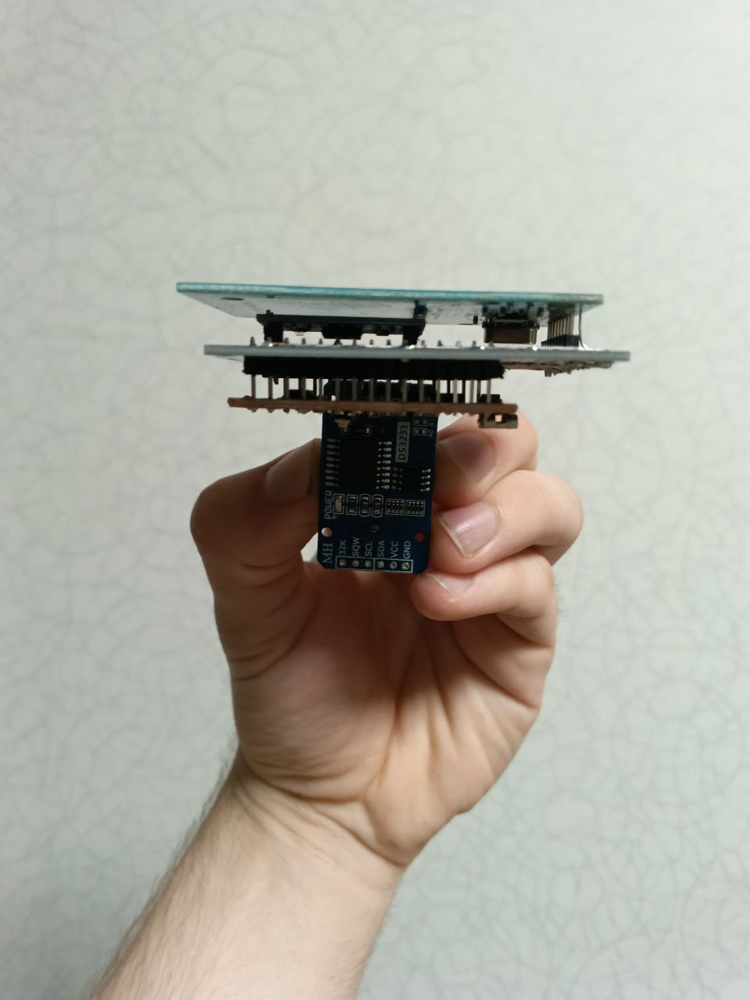
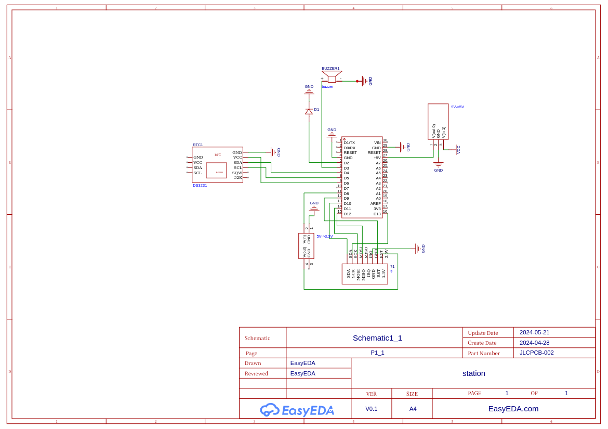
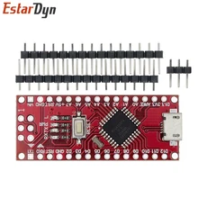
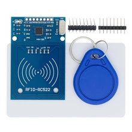
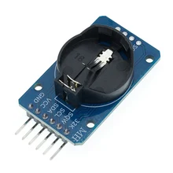
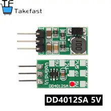
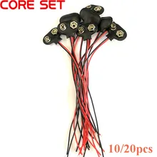
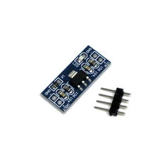

## Вид стацнии 
 
 

## Электронная схема 

## Потребляемый ток при тестирование sleapMode
Замеры показали следующие значения  потребляемого тока, в активном состояние 41.6 мА и  8.3 мА при входе в спящий режим. Измерения проводились при работе светодиодах на Arduino, RFID модуле и преобразователе наприжения с 5 до 3.3В. Сама станция работает от  9V кроны.  

## Составляющие части станции
Станция состаит из Arduino nano, модуля для радиочастотной индентификации RFID-RC522, контроллера времени DS3231, преобразователя наприжения с 5V в 3.3V на AMS117-3.3V, преобразователя напряжения с 9V в 5V и коннектора для баторейки кроны на 9V
  ### Arduino nano
    
  ### RFID-RC522
   
  ### RFID-RC522
   
  ### RFID-RC522
   
  ### RFID-RC522
   
  ### RFID-RC522
   
 
